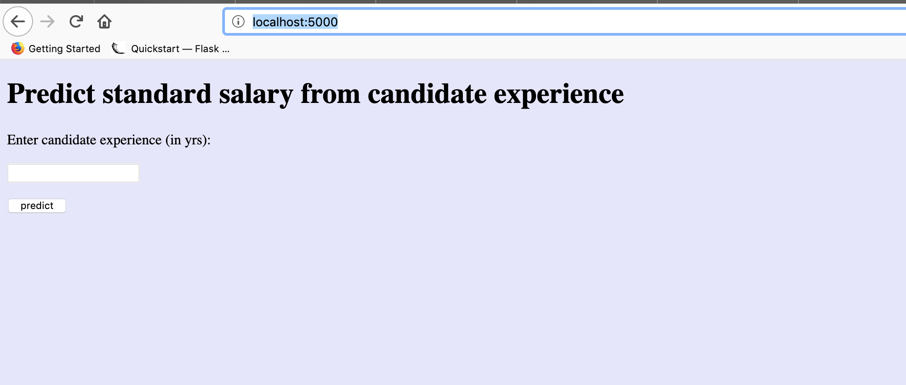

# Basic ML Model deployment using Flask
Tutorial for Deploying a Basic ML model using flask

### Steps to execute 
1. Clone the project ` git clone https://github.com/kaustuvkunal/BasicMLModelFlaskDeploy.git`
2. Change current directory to project directory  `cd BasicMLModelFlaskDeploy `
3. Install required dependencies/libraries  `pip3 install requirements.txt `
4. Buid & save model  `python model.py`
5. Execute flask app  ` python flask_app.py`
5. Open in web browser http://localhost:5000/

### Output 

